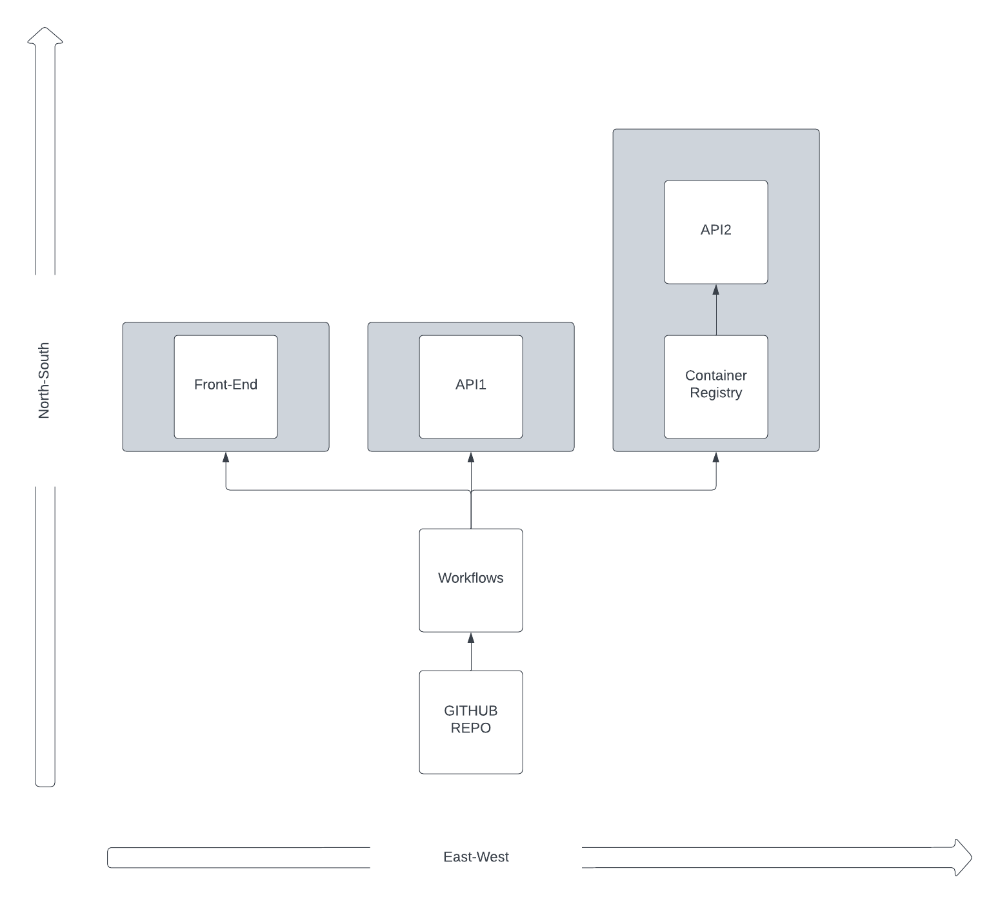

### Description of System Architecture Diagram

* The diagram is laid out on a coordinate system indicated by "North-South" and "East-West" axes, which represents the flow of data or the distribution of services across different regions or concerns.

* There are six main components in the diagram:

- Front-End: This represents the user interface or client side of the application.
- API1: An application programming interface that serves as an intermediary for the front-end to communicate with backend services.
- API2: Another API that is contained within a larger box labeled "Container Registry", suggesting this API is part of a service that manages the storage and retrieval of container images.
- Container Registry: A service for storing and managing container images, which provides the images for deploying services like API2.
- Workflows: This refers to automated processes or CI/CD pipelines that handle tasks such as testing, building, and deploying the software.
- GITHUB REPO: A repository hosted on GitHub where the source code is stored and version-controlled.

